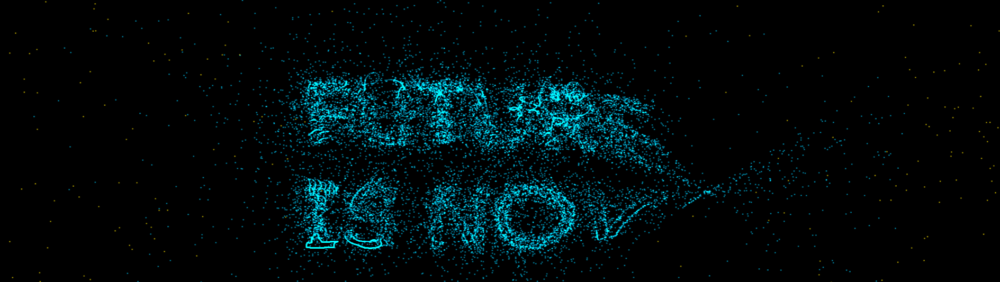
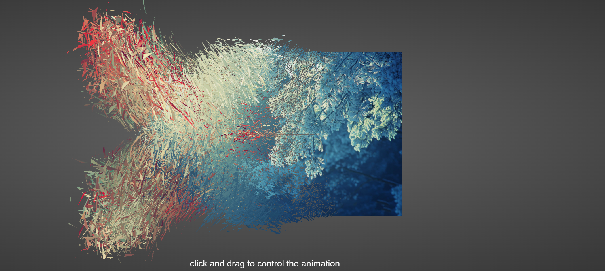

1.particle effects: https://codepen.io/sanprieto/pen/XWNjBdb
particles scattering and them forming the weclome text

2.image transition effect: https://codepen.io/zadvorsky/pen/PNXbGo

3.GSAP: https://greensock.com/gsap/

4.Star field:https://codepen.io/soju22/pen/JjEqebK

5.训练项目：https://github.com/QuarkGluonPlasma/threejs-exercize

6.partytown.js: off-load 3rd party scripts to a web worker to speed up your website

7.deso.com: example website for GSAP

8. snow flakes example: https://threejs.org/examples/#webgl_points_sprites

9. 酷炫人物颗粒化效果： https://threejs.org/examples/?q=dynamic#webgl_points_dynamic

10. cyberpunk 2077 3d example: https://3d-eosin.vercel.app/#/earthDigital

11. scroll control animation: https://codesandbox.io/s/4jr4p

12. infinite scroll design with text and images: https://codesandbox.io/s/yjhzv
